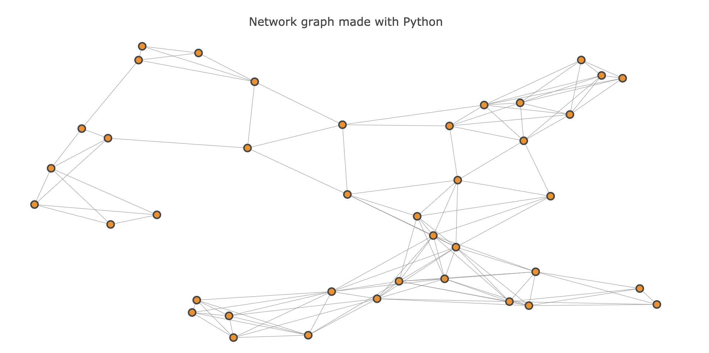

# Implementing a Route Planner
In this project you will use A\* search to implement a "Google-maps" style route planning algorithm.


```python
# Run this cell first!

from helpers import Map, load_map, show_map
from student_code import shortest_path

%load_ext autoreload
%autoreload 2


```


<script>requirejs.config({paths: { 'plotly': ['https://cdn.plot.ly/plotly-latest.min']},});if(!window.Plotly) {{require(['plotly'],function(plotly) {window.Plotly=plotly;});}}</script>


### Map Basics


```python
map_10 = load_map('map-10.pickle')
show_map(map_10)
```


The map above (run the code cell if you don't see it) shows a disconnected network of 10 intersections. The two intersections on the left are connected to each other but they are not connected to the rest of the road network. On the graph above, the edge between 2 nodes(intersections) represents a literal straight road not just an abstract connection of 2 cities.

These `Map` objects have two properties you will want to use to implement A\* search: `intersections` and `roads`

**Intersections**

The `intersections` are represented as a dictionary. 

In this example, there are 10 intersections, each identified by an x,y coordinate. The coordinates are listed below. You can hover over each dot in the map above to see the intersection number.


```python
map_10.intersections
```


    {0: [0.7798606835438107, 0.6922727646627362],
     1: [0.7647837074641568, 0.3252670836724646],
     2: [0.7155217893995438, 0.20026498027300055],
     3: [0.7076566826610747, 0.3278339270610988],
     4: [0.8325506249953353, 0.02310946309985762],
     5: [0.49016747075266875, 0.5464878695400415],
     6: [0.8820353070895344, 0.6791919587749445],
     7: [0.46247219371675075, 0.6258061621642713],
     8: [0.11622158839385677, 0.11236327488812581],
     9: [0.1285377678230034, 0.3285840695698353]}


**Roads**

The `roads` property is a list where, if `i` is an intersection, `roads[i]` contains a list of the intersections that intersection `i` connects to.


```python
# this shows that intersection 0 connects to intersections 7, 6, and 5
map_10.roads[0] 
```


    [7, 6, 5]


```python
# This shows the full connectivity of the map
map_10.roads
```


    [[7, 6, 5],
     [4, 3, 2],
     [4, 3, 1],
     [5, 4, 1, 2],
     [1, 2, 3],
     [7, 0, 3],
     [0],
     [0, 5],
     [9],
     [8]]


```python
# map_40 is a bigger map than map_10
map_40 = load_map('map-40.pickle')
show_map(map_40)
```



### Advanced Visualizations

The map above shows a network of roads which spans 40 different intersections (labeled 0 through 39). 

The `show_map` function which generated this map also takes a few optional parameters which might be useful for visualizaing the output of the search algorithm you will write.

* `start` - The "start" node for the search algorithm.
* `goal`  - The "goal" node.
* `path`  - An array of integers which corresponds to a valid sequence of intersection visits on the map.


```python
# run this code, note the effect of including the optional
# parameters in the function call.
show_map(map_40, start=5, goal=34, path=[5,16,37,12,34])
```


### Writing your algorithm
You should open the file `student_code.py` in another tab and work on your algorithm there. Do that by selecting `File > Open` and then selecting the appropriate file.

The algorithm you write will be responsible for generating a `path` like the one passed into `show_map` above. In fact, when called with the same map, start and goal, as above you algorithm should produce the path `[5, 16, 37, 12, 34]`

```bash
> shortest_path(map_40, 5, 34)
[5, 16, 37, 12, 34]
```


```python
path = shortest_path(map_40, 5, 34)
if path == [5, 16, 37, 12, 34]:
    print("great! Your code works for these inputs!")
else:
    print("something is off, your code produced the following:")
    print(path)
```

    great! Your code works for these inputs!


```python
path = shortest_path(map_40, 5, 36)
if path == [5, 16, 37, 22, 39, 36]:
    print("great! Your code works for these inputs!")
else:
    print("something is off, your code produced the following:")
    print(path)
```

    great! Your code works for these inputs!


```python
path = shortest_path(map_40, 8, 24)
if path == [8, 14, 16, 37, 12, 17, 10, 24]:
    print("great! Your code works for these inputs!")
else:
    print("something is off, your code produced the following:")
    print(path)
```

    great! Your code works for these inputs!


```python
path = shortest_path(map_40, 5, 5)
if path == [5]:
    print("great! Your code works for these inputs!")
else:
    print("something is off, your code produced the following:")
    print(path)
```

    great! Your code works for these inputs!


### Testing your Code
If the code below produces no errors, your algorithm is behaving correctly. You are almost ready to submit! Before you submit, go through the following submission checklist:

**Submission Checklist**

1. Does my code pass all tests?
2. Does my code implement `A*` search and not some other search algorithm?
3. Do I use an **admissible heuristic** to direct search efforts towards the goal?
4. Do I use data structures which avoid unnecessarily slow lookups?

When you can answer "yes" to all of these questions, submit by pressing the Submit button in the lower right!


```python
from test import test

test(shortest_path)
```

    All tests pass! Congratulations!


```python

```


# A Star Search Implementation

It is done using a priority queue using a min heap in order to quickly retrieve the min path element
in O(1). Insert and Removal into the priority queue take O(logn) due to the heapify process